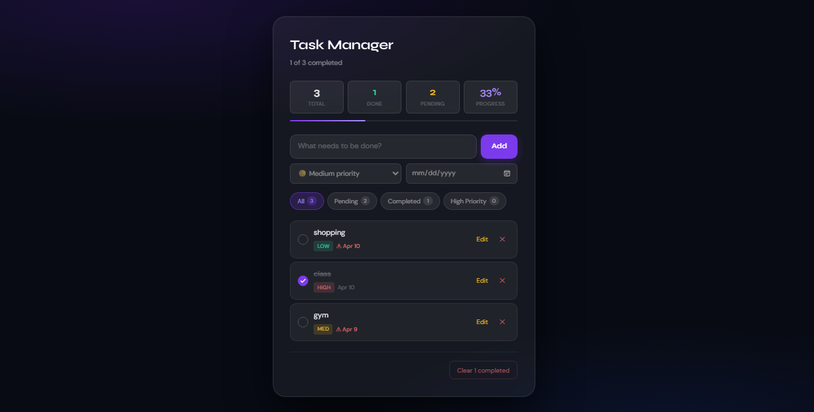

# Task Manager

> A sleek, full-featured task management app built with React 18 and Vite — featuring priority levels, due dates, real-time filtering, and persistent storage.

<br />


<br />

## 📸 Preview

## 📸 Preview



<br />

## ✨ Features

- ✅ **Add tasks** with a title, priority level, and optional due date
- 🔴🟡🟢 **Priority badges** — High, Medium, and Low with colour-coded labels
- ⚠️ **Overdue detection** — tasks past their due date are flagged automatically
- 🔍 **Smart filters** — view All, Pending, Completed, or High Priority tasks
- ✏️ **Inline editing** — edit any task in place, save with Enter or Escape to cancel
- 📊 **Live progress bar** — tracks completion percentage in real time
- 🗑️ **Clear completed** — bulk remove all finished tasks in one click
- 💾 **Persistent storage** — tasks survive page refreshes via `localStorage`
- 📱 **Responsive design** — works cleanly on mobile and desktop

<br />

## 🗂️ Project Structure

```
src/
├── components/
│   ├── TaskInput.jsx       # Add-task form: text, priority, due date
│   ├── TaskFilters.jsx     # Filter tabs with live task counts
│   ├── TaskStats.jsx       # Progress bar and summary stat chips
│   ├── TaskList.jsx        # Renders filtered list + empty states
│   └── TaskItem.jsx        # Individual task row with edit & delete
│
├── hooks/
│   ├── useTasks.js         # All task CRUD logic (add, toggle, edit, delete)
│   └── useLocalStorage.js  # Generic reusable persistent-state hook
│
├── App.jsx                 # Root component — composes all pieces
├── index.css               # Design system: tokens, layout, animations
└── main.jsx                # React entry point
```

<br />

## 🛠️ Tech Stack

| Purpose          | Technology                                |
| ---------------- | ----------------------------------------- |
| Framework        | React 18 (with Hooks)                     |
| Build tool       | Vite 5                                    |
| Styling          | CSS custom properties + Tailwind CSS      |
| State management | `useState`, custom hooks                  |
| Persistence      | `localStorage` via `useLocalStorage` hook |
| Fonts            | Syne (display) · DM Sans (body)           |

<br />

## 🚀 Getting Started

### Prerequisites

- Node.js 18+
- npm or yarn

### Installation

```bash
# 1. Clone the repository
git clone https://github.com/yourusername/task-manager.git

# 2. Navigate into the project
cd task-manager

# 3. Install dependencies
npm install

# 4. Start the dev server
npm run dev
```

The app will be running at **http://localhost:5173**

### Build for production

```bash
npm run build
```

<br />

## 🧠 Key Implementation Details

### Custom Hooks

**`useLocalStorage(key, initialValue)`**
A generic hook that syncs any state value to `localStorage` automatically. Decouples persistence logic from components — can be reused across any future feature.

```js
const [tasks, setTasks] = useLocalStorage("tm-tasks", []);
```

**`useTasks()`**
Encapsulates all task business logic — add, toggle, edit, delete, clear, and stats — returning a clean API to `App.jsx`. Components never manipulate task state directly.

```js
const { tasks, addTask, toggleTask, updateTask, deleteTask, getStats } =
  useTasks();
```

### Component Architecture

`App.jsx` acts purely as an **orchestrator** — it holds filter state and wires components together without owning any task logic. Each component has a single, clearly defined responsibility.

### Overdue Detection

```js
function isOverdue(dateStr) {
  if (!dateStr) return false;
  const today = new Date();
  today.setHours(0, 0, 0, 0);
  return new Date(dateStr + "T00:00:00") < today;
}
```

Midnight-normalised comparison prevents false positives on the current day.

<br />

## 📁 Available Scripts

| Script            | Description                          |
| ----------------- | ------------------------------------ |
| `npm run dev`     | Start local development server       |
| `npm run build`   | Build optimised production bundle    |
| `npm run preview` | Preview the production build locally |
| `npm run lint`    | Run ESLint checks                    |

<br />

## 🔮 Possible Future Improvements

- [ ] Drag-and-drop task reordering
- [ ] Task categories / labels
- [ ] Dark / light theme toggle
- [ ] Search / text filter
- [ ] Task detail modal with notes
- [ ] Export tasks as CSV

<br />

## 👤 Author

**Your Name**

- GitHub: [@yourusername](https://github.com/yourusername)
- LinkedIn: [linkedin.com/in/yourprofile](https://linkedin.com/in/yourprofile)
- Portfolio: [yourwebsite.com](https://yourwebsite.com)

<br />

## 📄 License

This project is open source and available under the [MIT License](LICENSE).

---

<p align="center">Built with ☕ and React</p>
